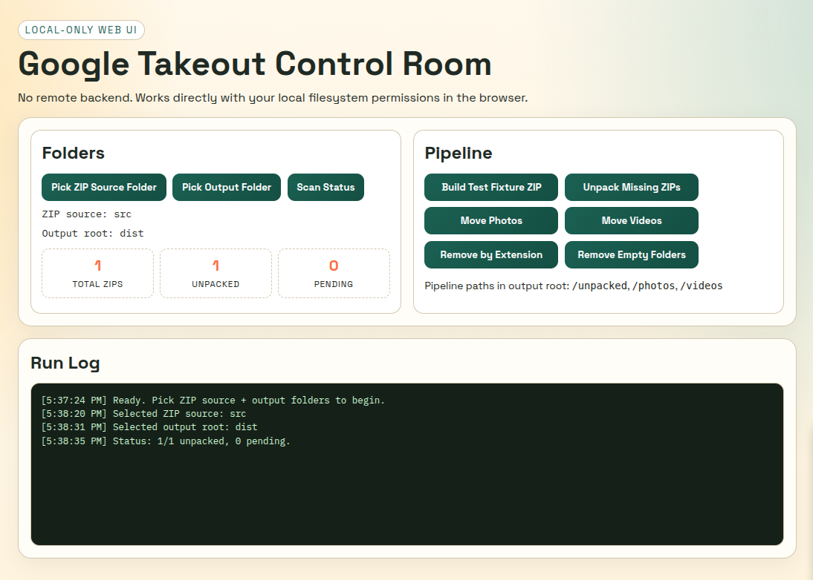
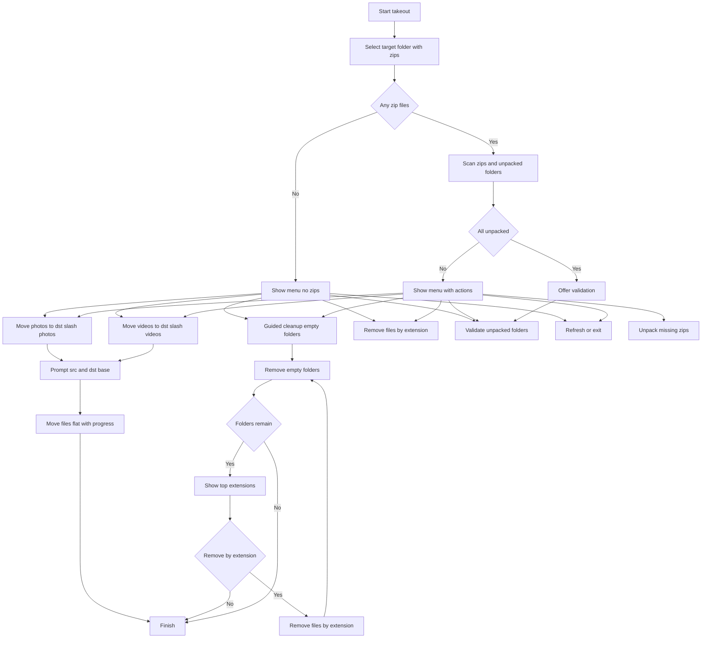

# Google Takeout

Welcome to the Google Takeout helper repository.

It is annoying how hard it is to take photos out of Google Photos. 

They seem to have done everything possible to make it as difficult as possible. 

This script provides a bit of that functionality. It works on Linux (and I think on macOS).


How to use:

Start Web UI (default):

```bash
./takeout
```



Start terminal mode:

```bash
./takeout cli
```

I assume you’ve downloaded all the 
ZIP files into a single folder. This could be improved if Google had an API to request and download everything automatically — but no, I don’t think they’ll ever do that; it’s not in their interest 🙂. When you do it manually, they ask you to confirm your identity every 5–10 ZIPs, which shows how hard they don’t want you to go through with it. So we assume you download the ZIPs once.

```bash
./takeout /media/USER/DRIVE/takeout
Status:
-------
27 out of 127 unpacked
100 not unpacked

Next step:
----------
  1) Validate unpacked folders contain data
  2) Unpack missing zips
  3) Refresh status
  4) Exit

```

Move files (flat):

```bash
# Photos
./src/move_files_flat.js --src /media/USER/DRIVE/takeout --dst /media/USER/DRIVE/takeout/photos --type image

# Videos
./src/move_files_flat.js --src /media/USER/DRIVE/takeout --dst /media/USER/DRIVE/takeout/videos --type video

# Dry run
./src/move_files_flat.js --dry-run --src /media/USER/DRIVE/takeout --dst /media/USER/DRIVE/takeout/photos --type image
```

TODO: add more file types for each section when moving files.

## Move Files Flat Feature

Purpose: consolidate nested Takeout media into a single destination folder. It supports images and videos, avoids reprocessing the destination tree, and resolves filename collisions by appending an incrementing suffix.

Flow:
- Source: a folder that already contains unpacked Takeout folders with nested media.
- Destination base: a folder where the script creates `photos/` and `videos/` subfolders.
- Photos step: moves image files into `<dst>/photos` with a flat structure.
- Videos step: moves video files into `<dst>/videos` with a flat structure.
- Progress: a progress bar is shown while the files are moved.
- Dry run: prints progress without moving any files.

Menu usage:
- Move photos to `<dst>/photos` (flat)
- Move videos to `<dst>/videos` (flat)
- Remove empty folders (guided cleanup)
- Remove files by extension

The guided cleanup walks you through removing empty folders and any remaining files by extension until there is nothing left to clean. The end result is a flat media layout with two folders: `photos/` and `videos/`.

TODO: next step will be sorting files and grouping them.

## Flow Diagram



## Move Files Flat Feature

Purpose: consolidate nested Takeout media into a single destination folder. It supports images and videos, avoids reprocessing the destination tree, and resolves filename collisions by appending an incrementing suffix.

Flow:
- Source: a folder that already contains unpacked Takeout folders with nested media.
- Destination base: a folder where the script creates `photos/` and `videos/` subfolders.
- Photos step: moves image files into `<dst>/photos` with a flat structure.
- Videos step: moves video files into `<dst>/videos` with a flat structure.
- Progress: a progress bar is shown while the files are moved.
- Dry run: prints progress without moving any files.

Menu usage:
- Move photos to `<dst>/photos` (flat)
- Move videos to `<dst>/videos` (flat)

## What does it give you? Why not do it manually?

You can’t just select all 10,000 ZIP files and unpack them at once — it will fail. You have to do it sequentially, and then you still need to check that everything unpacked correctly and that nothing was lost. That would take hours to do by hand. This simple script helps with exactly that.

## Why not just use some smart unzip tool that does it all?

Sure, you could — I just don’t know any. And besides that, it’s more than just unzipping: once everything is unpacked, you still have to do some shuffling and go through the folders, which takes time too.

### Why Node.js scripts?

Node.js keeps the tool portable while still allowing shell utilities (`zip`, `unzip`) where needed.


## Links:
- Google Takeout Photos: https://takeout.google.com/settings/takeout/custom/photos
- Related article: [I Sold the Lens Before It Sold Me](https://medium.com/@sergii_54085/i-sold-the-lens-before-it-sold-me-4bdecb778559?postPublishedType=repub)
- Any questions or suggestions? Feel free to contact me: https://starodubtsev.consulting/

## Test Fixture (`test/src` and `test/dist`)

Use a stable ZIP fixture for repeated testing.

- `test/src/takeout-sample.zip` is the test ZIP input.
- `test/dist/` is recreated on each smoke test run and contains extracted/unpacked outputs.

Build/update the fixture ZIP from source files:

```bash
./src/build_test_fixture_zip.js
```

Run smoke test (unzip + flat move checks):

```bash
./src/smoke_test_fixture.js
```

Fixture source files are stored in:

- `test/src/source/takeout-sample/`

## Web UI (No Remote Backend)

A local-first web UI is available in `ui/`.

- Entry point: `ui/index.html`
- Browser requirement: Chromium-based browser with File System Access API
- Runtime model: browser UI + direct local folder permissions, no remote backend

### Run

Serve `ui/` as static files (secure context is required for folder picker APIs):

```bash
cd ui
python3 -m http.server 4173
```

Then open:

- `http://localhost:4173`

### UI Flow

1. Pick ZIP source folder (recommended for tests: `test/src`)
2. Pick output folder (recommended for tests: `test/dist`)
3. Use actions:
   - `Scan Status`
   - `Build Test Fixture ZIP`
   - `Unpack Missing ZIPs`
   - `Move Photos`
   - `Move Videos`
   - `Remove by Extension`
   - `Remove Empty Folders`
